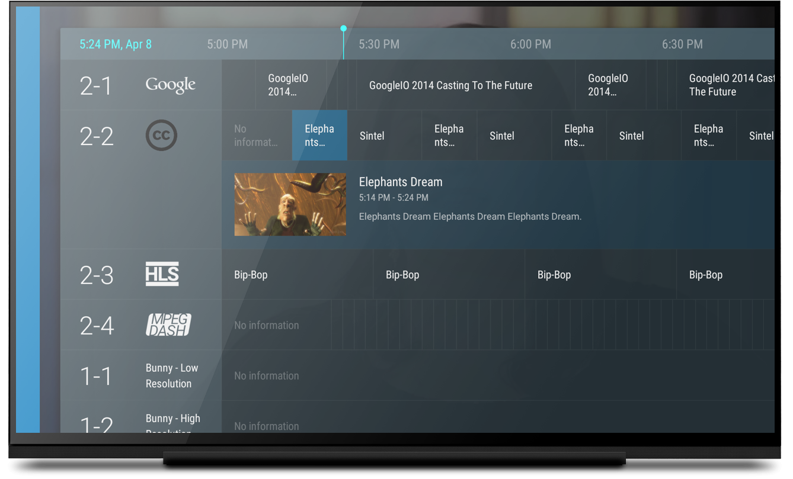
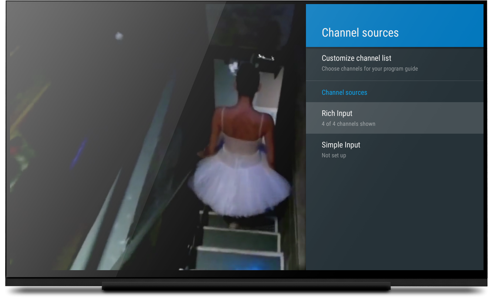
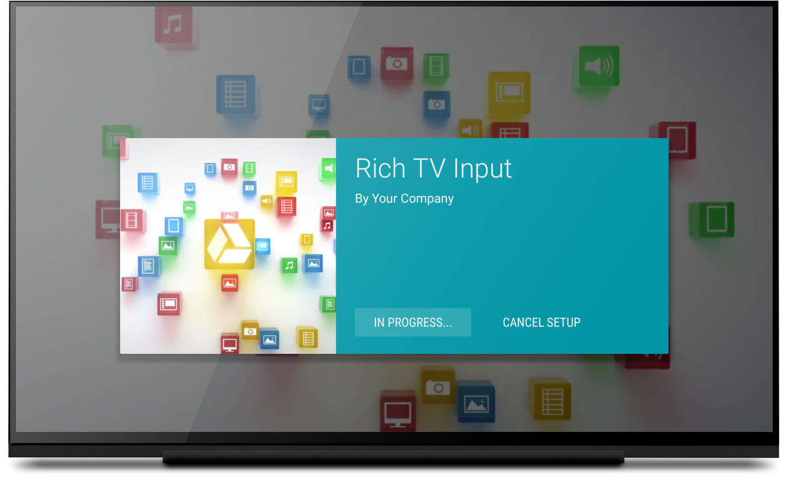

Sample for live TV Input Framework (TIF) on Android TV
======================================================

This app is designed to show how to build live TV apps for Android TV.  The sample is a service that once installed, it's recognized and run by the default TV app (a.k.a. Live Channels).

Introduction
------------

The sample app consists of two TV inputs.

- Simple TV input: 2 channels from local video files.
- Rich TV input: 4 channels consisting of MP4 videos, HLS stream and MPEG-DASH stream, organized into various genres.  Its XML feed is at: http://commondatastorage.googleapis.com/android-tv/rich_tv_inputs_tif.xml and video files are served from Google Cloud Storage. 

References and Developer Guides

- [Building Live TV Apps](http://developer.android.com/training/tv/tif/index.html)
- [Android TV: TV Input Framework reference](https://developer.android.com/reference/android/media/tv/package-summary.html)

Pre-requisites
--------------

- ExoPlayer with HLS support: http://developer.android.com/guide/topics/media/exoplayer.html
- Android SDK v7 appcompat library
- Android SDK v17 leanback support library
- Android SDK v7 recyclerview library

Getting Started
---------------

- Get code: git clone the project from https://github.com/googlesamples/androidtv-sample-inputs.git.
- Compile the project and install the app to your Android TV device.
- Start the pre-installed system app Live Channels to configure TV input sources.

Note that the Live Channels app does not show up in Apps on Home screen unless there is at least one TV input service or a physical input like HDMI1.

To set up the Rich TV input:
- Start Live Channels app
- Click Search to search for and add channels
- Alternatively within Live Channels app, 
  + Click ENTER to bring out Recent Channels
  + Click DOWN to enter TV options
  + Click RIGHT to Channel sources and select it
  + Click DOWN to select Rich Input and click ENTER to select it
  + Click ADD CHANNELS NOW to add channels of MP4 videos, HLS stream and MPEG-DASH stream
- To watch sample channels, simply toggle UP and DOWN to switch channels
- Visit Channel Sources -> Rich Input -> Settings to see mock options for input settings.

Screenshots
-----------

Support
-------
- Android TV Google+ Community: [https://g.co/androidtvdev](https://g.co/androidtvdev)
- Stack Overflow: http://stackoverflow.com/questions/tagged/android-tv

License
-------
License under the Apache 2.0 license. See the LICENSE file for details.

How to make contributions?
--------------------------
Please read and follow the steps in the CONTRIBUTING.md

Change List
-----------
Version 1.0

Notice
------
Images/videos used in this sample are courtesy of the Blender Foundation, shared under copyright or Creative Commons license.

- Elephant's Dream: (c) copyright 2006, Blender Foundation / Netherlands Media Art Institute / www.elephantsdream.org
- Sintel: (c) copyright Blender Foundation | www.sintel.org
- Tears of Steel: (CC) Blender Foundation | mango.blender.org
- Big Buck Bunny: (c) copyright 2008, Blender Foundation / www.bigbuckbunny.org
